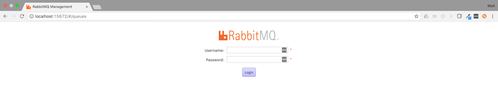
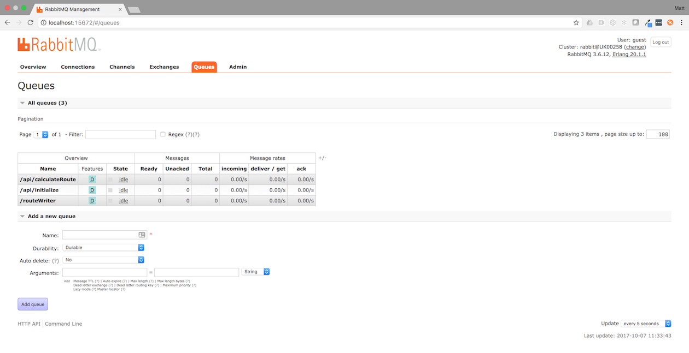

# Orizuru Sample App

## Architecture

## Getting Started

Deploy the Salesforce component of the app using the button below.

## Deploying to Force.com
This project is built using [Salesforce DX](https://www.salesforce.com/products/platform/products/salesforce-dx/).

1. If you don't have the SFDX CLI...
	1. Download it [here](https://developer.salesforce.com/tools/sfdxcli)
	1. Alternatively, install via brew
		* `brew cask install caskroom/cask/sfdx`

1. Sign up for a Dev Hub trial.
	1. Complete the form on the [sign up page](https://developer.salesforce.com/promotions/orgs/dx-signup)
	1. Note. The org will expire in 30 days

1. Open the command line in the root folder of this project.

1. Authorize the Dev Hub.
	* `sfdx force:auth:web:login -d`
	* Enter username and password
	* Press allow when prompted to allow access to 'Global Connected App'

1. Setup a scratch org.
	1. Create a scratch org: 
		* `sfdx force:org:create -f src/apex/config/project-scratch-def.json -s`
	1. Push source to scratch org:
		* `sfdx force:source:push`
	1. Assign yourself the OrizuruAdmin permission set:
		* `sfdx force:user:permset:assign -n OrizuruAdmin`
	1. Launch the scratch org in a browser:
		* `sfdx force:org:open`

1. Set up the Connected App.
	1. Go to `Setup`.
	1. Select `Apps` > `Connected Apps` > `Manage Connected Apps`.
	1. Select `Orizuru`.
	1. Select `Edit Policies` and change the permitted users to `Admin approved users are pre-authorized`.
	1. If you are developing locally then you need to update your `local.run.properties` file with the new Connected App Consumer Key.
		* Go to `Setup`.
		* Select `Apps` > `App Manager`.
		* Select `View` from the drop down on the `Orizuru` Connected App.
		* In the `local.run.properties` file, update `OPENID_CLIENT_ID` with the `Consumer Key`.

1. Add the Connected App to the Permission Set and assign it to your user.
	1. Go to `Permission Sets`.
	1. Select `Orizuru Admin`.
	1. Select `Assigned Connected Apps`.
	1. Select `Edit`.
	1. Add `Orizuru` to the `Enabled Apps`.
	1. `Save`.
	1. Select `Manage Assignments`.
	1. Add the permission set to your user.

## Local Development Environment

### RabbitMQ Setup

This project uses [RabbitMQ](https://www.rabbitmq.com/) as the messaging framework to communicate between Heroku dynos. 

To debug the project locally, RabbitMQ need to be running with the required queues, follow these steps to get up and running.

1. Install [RabbitMQ](https://www.rabbitmq.com/)
	* Download it [here](https://www.rabbitmq.com/download.html)
	* Alternatively, install via brew
		* `brew install rabbitmq`

1. After the installation is complete, start the RabbitMQ server
	* `rabbitmq-server -detached`

1. Navigate to [http://localhost:15672/#/](http://localhost:15672/#/) and login.
	* The default username is `guest` with the password `guest`.
	
		
1. Add the required queues.
	* Select the `Queues` tab.
	* Expand the `Add a new queue` section.
	* Add the queue name `/api/initialize`.
	* Select `Add queue`.
	* Repeat the last two steps for the queues `/api/calculateRoute` and `/routeWriter`.
	* You should end up with something like this:

		

1. Configure the project to use the local instance of RabbitMQ.
	* Open `local.run.properties`
	* Add `CLOUDAMQP_URL=amqp://localhost`
